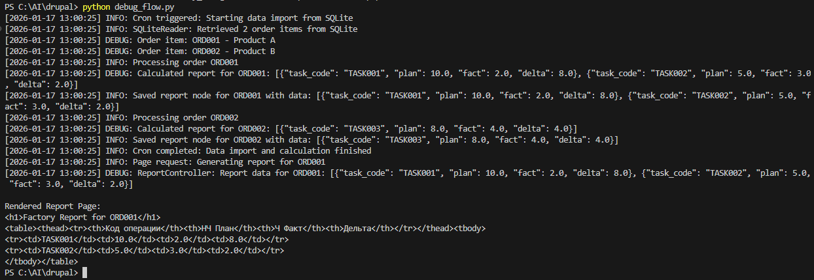

# Factory Bridge Module

Модуль `factory_bridge` для Drupal 10/11, предназначенный для интеграции с внешней базой данных SQLite и отображения отчётов по производственным изделиям.

## Описание

Модуль выполняет роль моста между внешней SQLite БД (`workshop_bot.db`) и Drupal. Он регулярно импортирует данные об изделиях и операциях, рассчитывает показатели план/факт/дельта и сохраняет агрегированные данные в Drupal для последующего отображения.

## Архитектура

### Основные компоненты

- **SQLiteReader**: Сервис для чтения данных из внешней SQLite БД через Drupal Database API.
- **ReportCalculator**: Сервис для расчёта показателей план/факт/дельта на основе данных из SQLite.
- **ReportStorage**: Сервис для сохранения рассчитанных данных в сущности Drupal (Node типа `factory_report`).
- **ReportController**: Контроллер для отображения отчёта по изделию.
- **factory-bridge-report.html.twig**: Шаблон для вывода таблицы отчёта.

### Структура данных

#### Внешняя SQLite БД

- `order_items`: Изделия (internal_id, title, code)
- `assigned_tasks`: Операции по изделиям (order_internal_id, task_code, applied_norm_hours)
- `work_sessions`: Рабочие сессии (task_code, start_time, end_time)

#### Расчёты

Для каждого изделия:
- **НЧ План**: Сумма `applied_norm_hours` по всем задачам изделия
- **Ч Факт**: Сумма `(end_time - start_time)` по завершённым сессиям (end_time IS NOT NULL), в часах
- **Дельта**: План - Факт

## Установка

1. Скопируйте модуль в `modules/custom/factory_bridge/`
2. Настройте подключение к SQLite в `settings.php`:

```php
$databases['sqlite_external']['default'] = [
  'driver' => 'sqlite',
  'database' => '/path/to/workshop_bot.db',
];
```

3. Включите модуль: `drush en factory_bridge`
4. Запустите cron для импорта данных: `drush cron`

## Использование

### Импорт данных

Модуль автоматически импортирует данные по cron (стандартный Drupal cron).

При установке создаётся тип контента `factory_report` с полем `field_internal_id` для связи с изделиями.

### Просмотр отчёта

Отчёт по изделию доступен по URL: `/factory-bridge/report/{internal_id}`

Пример: `/factory-bridge/report/ORD001`

Таблица отчёта содержит:
- Код операции
- НЧ План
- Ч Факт
- Дельта

## API

### Сервисы

- `factory_bridge.sqlite_reader`: Чтение из SQLite
- `factory_bridge.report_calculator`: Расчёты
- `factory_bridge.report_storage`: Сохранение в Drupal

### Хуки

- `hook_cron()`: Запуск импорта
- `hook_install()`: Создание типа контента
- `hook_theme()`: Регистрация шаблона

## Пример данных

### SQLite

```sql
INSERT INTO order_items VALUES ('ORD001', 'Product A', 'PA001');
INSERT INTO assigned_tasks VALUES ('ORD001', 'TASK001', 10.0);
INSERT INTO work_sessions VALUES ('TASK001', '2023-01-01 08:00:00', '2023-01-01 10:00:00');
```

### Результат

Для ORD001:
- TASK001: План 10, Факт 2, Дельта 8

## Тестирование

Запустите `python test_module.py` для проверки расчётов на тестовых данных.

Для демонстрации полного процесса (cron, импорт данных, формирование страницы) используйте `python debug_flow.py`. Скрипт показывает:

### Cron срабатывает
- Импорт данных из SQLite (получает изделия ORD001, ORD002)
- Обработка каждого изделия с расчётами план/факт/дельта

### Формируется страница отчёта
- Для ORD001 рассчитываются:
  - TASK001: план 10, факт 2, дельта 8
  - TASK002: план 5, факт 3, дельта 2
- Генерация HTML-таблицы с результатами

### Данные из SQLite
- `order_items`: изделия (internal_id, title, code)
- `assigned_tasks`: операции (order_internal_id, task_code, applied_norm_hours)
- `work_sessions`: рабочие сессии (task_code, start_time, end_time) - только завершённые сессии (end_time IS NOT NULL)



## Логирование

Модуль включает логирование ключевых операций:
- `factory_bridge` канал в Drupal logs
- Уровни: info (основные события), debug (детали данных)
- Просмотр логов: `/admin/reports/dblog` (требуется модуль dblog)

## Требования

- Drupal 10 или 11
- Доступ к внешней SQLite БД
- PHP с поддержкой SQLite

## Безопасность

- Доступ к отчётам: `access content`
- SQL-запросы только через Drupal Database API
- Нет прямого доступа к внешней БД из шаблонов
